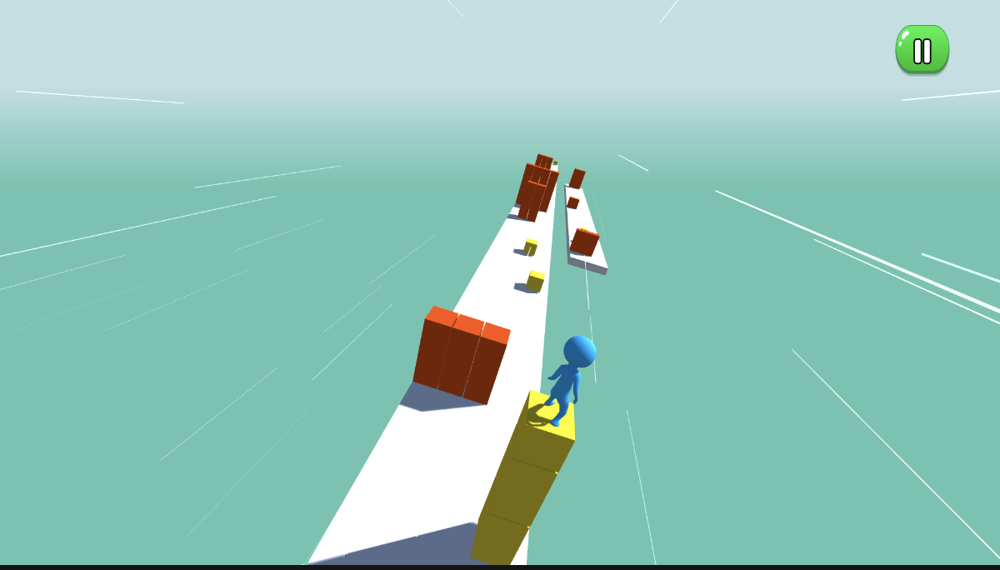

<h1>3D Endless Runner Clone</h1>

This project is a clone of a classic 3D endless runner game. It features an infinite procedurally generated track with random obstacles and collectible cubes. The game demonstrates the implementation of key mechanics such as endless level generation, obstacle avoidance, and item collection.

<h2>🚀 Key Features:</h2>
<ul>
    <li><strong>Endless Track Generation</strong>  
        
The game generates an infinite track with procedurally placed obstacles and collectible cubes.

    </li>
    <li><strong>Random Obstacles</strong>  
        
Obstacles appear randomly on the track, increasing the challenge as the player progresses.

    </li>
    <li><strong>Cube Collection</strong>  
        
Collectible cubes are scattered throughout the track, rewarding the player with points.

    </li>
    <li><strong>Classic 3D Runner Gameplay</strong>  
        
Simple yet engaging mechanics inspired by classic 3D runner games.

    </li>
</ul>

<h2>🛠️ Technologies:</h2>
<ul>
    <li>Unity Engine</li>
    <li>C# for Scripting</li>
    <li>Procedural Generation for Track and Obstacles</li>
</ul>

<h2>🌟 Purpose:</h2>

This project serves as a test task for a junior developer position, showcasing skills in game development and procedural content generation.

### Gameplay

